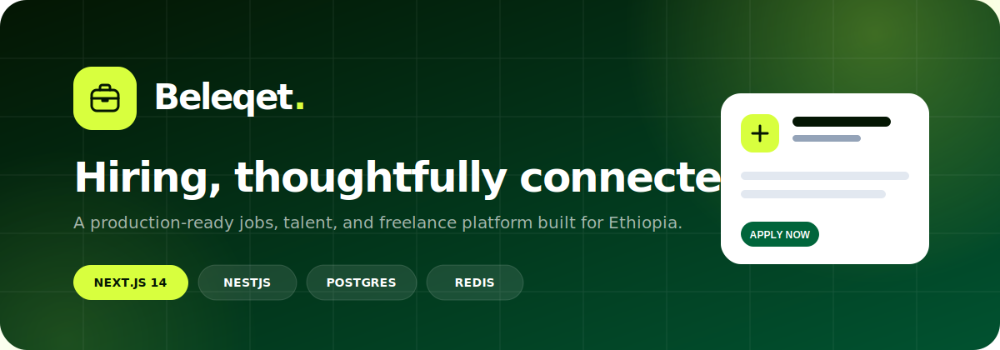
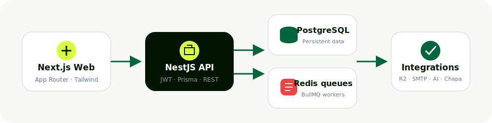

<div align="center">
  

  <br />

  <a href="https://beleqet-interview-task-mu.vercel.app"></a>
  <a href="https://beleqet-backend.onrender.com/api/v1/jobs/categories"></a>
  
  
  

  <h3>One platform for opportunities, talent, and trusted hiring.</h3>
  <p>Beleqet is a production-ready hiring and freelance platform designed for the Ethiopian market.</p>

  [Explore the platform](https://beleqet-interview-task-mu.vercel.app) · [Browse jobs](https://beleqet-interview-task-mu.vercel.app/jobs) · [API reference](backend/README.md) · [Frontend guide](beleqet-jobs-nextjs/README.md)
</div>

---

## ✦ Why Beleqet

Beleqet brings the full hiring journey into one coherent product—from discovering a role to screening applicants and managing employer workflows. It pairs a refined, responsive interface with a modular API, reliable background processing, and secure account controls.

| | Capability | What it delivers |
|---:|---|---|
| 🔎 | **Job discovery** | Search, location, category, and work-type filtering with a focused jobs workspace |
| ⚡ | **Fast applications** | Resume upload, cover letter, portfolio, salary expectations, and application tracking |
| 🏢 | **Employer workspace** | Company setup, vacancy publishing, applicant review, and candidate status management |
| ✨ | **AI-assisted screening** | Queue-driven candidate scoring and professional CV-summary assistance |
| 🧾 | **CV studio** | Draft persistence, live preview, document import, and print-ready export |
| 🔐 | **Account management** | Profile editing, password rotation, session invalidation, and notification preferences |
| 💬 | **Communication** | In-app notifications, email workflows, Telegram integration, contact inbox, and chat |
| 💳 | **Freelance infrastructure** | Gigs, bids, contracts, milestones, escrow, and wallet foundations |

## Architecture

<div align="center">
  
</div>

| Layer | Technology | Responsibility |
|---|---|---|
| **Web application** | Next.js 14 · React · TypeScript · Tailwind CSS | Responsive UI, server rendering, authenticated workflows |
| **API** | NestJS · Prisma · JWT · Swagger | Business rules, validation, authorization, REST endpoints |
| **Data** | PostgreSQL | Users, jobs, applications, profiles, payments, audit events |
| **Async processing** | Redis · BullMQ | Screening, analytics, notifications, and scheduled work |
| **Integrations** | Cloudflare R2 · SMTP · Groq/OpenAI · Telegram · Chapa | Files, messaging, AI assistance, and payments |

## Product surfaces

```text
Public                 Job seeker                 Employer                 Platform
├─ Home                ├─ Job search              ├─ Company profile       ├─ Admin console
├─ Jobs                ├─ Saved jobs              ├─ Publish vacancy       ├─ Contact inbox
├─ Job details         ├─ Applications            ├─ Applicant review      ├─ Broadcasts
├─ Pricing             ├─ CV maker                └─ Status workflow       └─ Audit events
└─ About / Contact     └─ Account settings
```

## Repository

```text
.
├── backend/                    NestJS API, Prisma schema, workers, and tests
├── beleqet-jobs-nextjs/        Next.js application, components, routes, and types
├── docs/                       README artwork and architecture diagrams
├── render.yaml                 Render infrastructure blueprint
└── Beleqet_System_Architecture.docx
```

## Quick start

### Prerequisites

- Node.js 20+
- Docker and Docker Compose
- npm 10+

### 1. Start the backend stack

```bash
cd backend
cp .env.example .env
docker compose up -d --build
```

The stack exposes:

- API: `http://localhost:4000/api/v1`
- Swagger: `http://localhost:4000/api/docs`
- PostgreSQL: `localhost:5432`
- Redis: `localhost:6379`

### 2. Start the web application

```bash
cd beleqet-jobs-nextjs
cp .env.example .env.local
npm install
npm run dev
```

Open `http://localhost:3000`.

### 3. Prepare demo data when needed

```bash
cd backend
npm run prisma:generate
npm run prisma:migrate
npm run prisma:seed
```

## Configuration

### Frontend

| Variable | Required | Example |
|---|:---:|---|
| `NEXT_PUBLIC_API_URL` | ✓ | `http://localhost:4000/api/v1` |
| `GROQ_API_KEY` | Optional | Server-side CV/chat assistance |
| `GROQ_MODEL` | Optional | `llama-3.1-8b-instant` |

### Backend

Core configuration lives in [`backend/.env.example`](backend/.env.example).

| Group | Variables |
|---|---|
| **Core** | `DATABASE_URL`, `REDIS_HOST`, `REDIS_PORT`, `JWT_ACCESS_SECRET` |
| **Cloud storage** | `R2_ACCOUNT_ID`, `R2_ACCESS_KEY_ID`, `R2_SECRET_ACCESS_KEY`, `R2_BUCKET_NAME`, `R2_PUBLIC_BASE_URL` |
| **Email** | `SMTP_HOST`, `SMTP_PORT`, `SMTP_USER`, `SMTP_PASSWORD`, `SMTP_FROM` |
| **Optional services** | `OPENAI_API_KEY`, `TELEGRAM_BOT_TOKEN`, `CHAPA_SECRET_KEY`, `CHAPA_WEBHOOK_SECRET` |

> Never expose backend secrets through `NEXT_PUBLIC_*` variables. The R2 bucket must exist and its name must exactly match `R2_BUCKET_NAME`.

## Quality gates

```bash
# Backend
cd backend
npm run build
npm test -- --runInBand

# Frontend
cd beleqet-jobs-nextjs
npx tsc --noEmit
npm run build
```

The project includes DTO validation, typed API boundaries, route error states, authorization guards, rate limiting, structured errors, and background-job isolation.

## Deployment

### Render

[`render.yaml`](render.yaml) provisions the backend, PostgreSQL, Redis, and frontend services. Add all `sync: false` secrets in the Render dashboard before deploying.

### Vercel

For a separate frontend deployment:

1. Import this repository.
2. Set the root directory to `beleqet-jobs-nextjs`.
3. Add `NEXT_PUBLIC_API_URL=https://<backend-host>/api/v1`.
4. Set the backend `FRONTEND_URL` to the deployed frontend origin.

> Render free services may take additional time to answer their first request after inactivity.

## Documentation

- [Backend modules and API routes](backend/README.md)
- [Frontend structure and design system](beleqet-jobs-nextjs/README.md)
- [Render infrastructure blueprint](render.yaml)
- [Postman collection](backend/Beleqet-API.postman_collection.json)

---

<div align="center">
  
  <p><strong>Beleqet.</strong><br />Built for opportunity. Designed for trust.</p>
</div>
